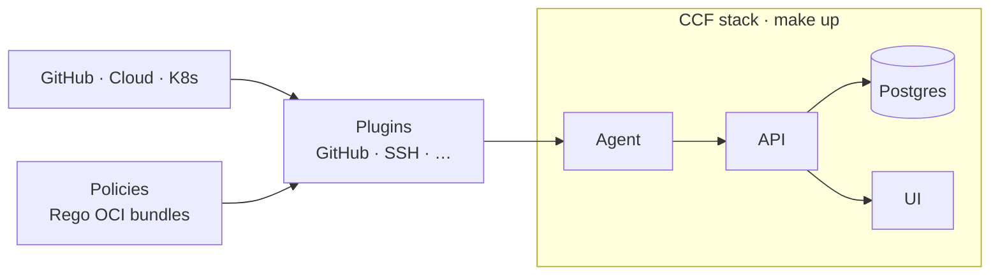

# CCF Helm Charts

Helm charts to deploy the [Continuous Compliance Framework (CCF)](https://continuouscompliance.io/) on Kubernetes — control plane (PostgreSQL + API + UI), compliance agent (plugins + policies), optional HA Postgres, observability, and GitOps manifests.



## Documentation

**Full guides live in [`docs/`](./docs/README.md).**

| Guide | Topics |
|-------|--------|
| [Quick start](./docs/quickstart.md) | Local demo, AKS smoke test, observability, load tests |
| [**Setup evidence**](./docs/setup-evidence.md) | Screenshots: UI, Grafana, Prometheus, validation checklist |
| [**Components explained**](./docs/components.md) | What each CCF piece is (API, agent, plugin, policy, OSCAL, …) |
| [**Production deployment**](./docs/production.md) | Standard prod profile, reliability, secrets, alerts, runbook |
| [**Architecture**](./docs/architecture.md) | How CCF, agent, plugins, policies, and OSCAL fit together |
| [**Helm configuration**](./docs/helm-configuration.md) | Values layering, every chart option, secrets, hooks, production |
| [**Plugins & policies**](./docs/policies-and-plugins.md) | Configure plugins, write Rego, build OCI bundles, deploy |
| [**Makefile reference**](./docs/makefile-reference.md) | All targets, variables, port-forwards |
| [**Observability**](./docs/observability.md) | Logs, metrics, Grafana dashboard, Prometheus alerts |

## Quick commands

```bash
make help        # public targets

make up          # CCF stack (Docker Desktop)
make obs         # observability (Loki/Prometheus/Grafana/Alloy)
make pf-all      # port-forward UI, API, Grafana, Prometheus, Loki

make aks         # CCF on AKS (current kube-context)
make policy      # validate + test custom Rego policies
make validate    # offline helm lint + render all overlays
make loadtest    # k6 API load test (after make pf)
make down        # uninstall CCF
```

**Local login** (after `make up` + `make pf`): http://localhost:8000 — `admin@ccf.local` / `Admin12345!`

**Populate the UI** (OSCAL demo data): enabled by default on local (`values/local.yaml`). On AKS: `make aks SEED=1`

**GitHub org demo**: see [Quick start §3](./docs/quickstart.md#3-github-organisation-demo)

## Chart structure

This repository is the **standard CCF Helm package** for Kubernetes — production-ready defaults, observability integration, and full documentation.

```
ccf/                       umbrella (single-command install)
└── charts/
    ├── ccf-app/           PostgreSQL + API + UI  (control plane)
    └── ccf-agent/         plugin scheduler       (collection layer)
```

| Profile | Values file | Use case |
|---------|-------------|----------|
| Local demo | `values/local.yaml` | Docker Desktop, seed OSCAL, agent register, port-forward |
| AKS smoke test | `values/aks.yaml` | Minimal Azure validation |
| **Production** | `values/production.yaml` | HA, PDB, HPA, ingress, GitHub plugin |

```bash
# Production (Secrets required first — see docs/production.md)
make prod ADMIN_PASSWORD='...' GITHUB_TOKEN=... GITHUB_ORG=...
make obs    # Loki + Prometheus alerts + Grafana dashboard
make loadtest-smoke   # k6 API smoke (after make pf)
```

| Component | Image | Purpose |
|-----------|-------|---------|
| PostgreSQL | `ghcr.io/compliance-framework/pg-ccf` | Datastore |
| API | `ghcr.io/compliance-framework/api:0.16.0` | OSCAL reporting API |
| UI | `ghcr.io/compliance-framework/ui:2.9.1` | Web frontend |
| Agent | `ghcr.io/compliance-framework/agent:0.7.1` | Runs plugins on schedule |

See [Production deployment](./docs/production.md) for the production profile.

## Values layout

**Image registry and tags** — defaults live in each subchart (`charts/ccf-app/values.yaml`, `charts/ccf-agent/values.yaml` → `images.registry`, `images.*.tag`). Mirror with `make up REGISTRY_PREFIX=your.registry/...` or override per component.

Layer environment + plugins + optional overlays:

```
values.yaml                  umbrella defaults (enable subcharts)
values/local.yaml            Docker Desktop demo
values/aks.yaml              AKS smoke test
values/production.yaml       production profile
values/plugins/              plugin + custom policy overlays (see README there)
loadtest/                    k6 API smoke + load tests
docs/images/                 setup screenshots
policies/                    custom Rego (author → bundle → OCI)
observability/               Grafana + Alloy + Prometheus alert rules
```

Image defaults (change in subchart values or override at install):

```yaml
# charts/ccf-app/values.yaml
images:
  registry: ghcr.io/compliance-framework
  api:    { repository: api, tag: "" }      # tag defaults to Chart appVersion
  ui:     { repository: ui, tag: "2.9.1" }
  postgres: { repository: pg-ccf, tag: "0.0.5" }

# charts/ccf-agent/values.yaml
images:
  registry: ghcr.io/compliance-framework
  agent:  { repository: agent, tag: "0.7.1" }
```

Umbrella keys are prefixed: `ccf-app.api.*`, `ccf-agent.config.plugins.*`.

## Prerequisites

- Kubernetes 1.23+, Helm 3.8+
- **Local:** Docker Desktop Kubernetes (`docker-desktop` context)
- **AKS:** Azure CLI + cluster credentials
- **Policies:** OPA CLI (`make policy`)

## Install (helm directly)

```bash
helm dependency build .

helm upgrade --install ccf . \
  --kube-context docker-desktop \
  --namespace ccf --create-namespace \
  -f values/local.yaml
```

Secrets (GitHub token, admin password) — inject at install time; see [Makefile reference](./docs/makefile-reference.md).

## Uninstall

```bash
make down
# or: helm uninstall ccf -n ccf
```

## Related

- [CCF project docs](https://compliance-framework.github.io/docs/)
- [Upstream helm-charts](https://github.com/compliance-framework/helm-charts)
- [Plugin catalogue](https://github.com/orgs/compliance-framework/repositories?q=plugin-)
