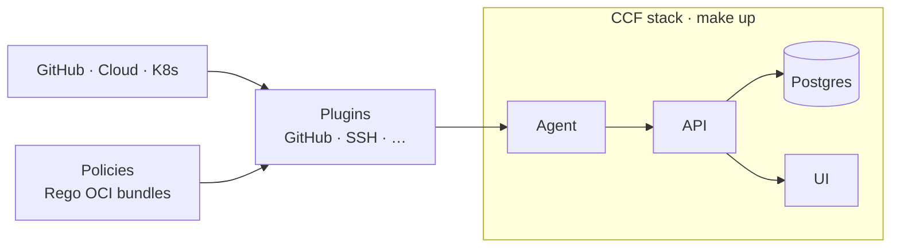

# CCF Helm Charts

Helm charts to deploy the [Continuous Compliance Framework (CCF)](https://continuouscompliance.io/) on Kubernetes — control plane (PostgreSQL + API + UI), compliance agent (plugins + policies), optional HA Postgres, observability, and GitOps manifests.



## Documentation

**Full guides live in [`docs/`](./docs/README.md).**

| Guide | Topics |
|-------|--------|
| [**Quick start**](./docs/quickstart.md) | Local demo, GitHub demo, AKS, observability, smoke tests |
| [**Architecture**](./docs/architecture.md) | How CCF, agent, plugins, policies, and OSCAL fit together |
| [**Helm configuration**](./docs/helm-configuration.md) | Values layering, every chart option, secrets, hooks, production |
| [**Plugins & policies**](./docs/policies-and-plugins.md) | Configure plugins, write Rego, build OCI bundles, deploy |
| [**Makefile reference**](./docs/makefile-reference.md) | All targets, variables, port-forwards |
| [**Observability**](./docs/observability.md) | Logs, metrics, Grafana dashboard |

## Quick commands

```bash
make help        # public targets

make up          # CCF stack (Docker Desktop)
make obs         # observability (Loki/Prometheus/Grafana/Alloy)
make pf-all      # port-forward UI, API, Grafana, Prometheus, Loki

make aks         # CCF on AKS (current kube-context)
make policy      # validate + test custom Rego policies
make validate    # offline helm lint + render all overlays
make down        # uninstall CCF
```

**Local login** (after `make up` + `make pf`): http://localhost:8000 — `admin@ccf.local` / `Admin12345!`

**Populate the UI** (empty by default): `make up SEED=1`

**GitHub org demo**: see [Quick start §3](./docs/quickstart.md#3-github-organisation-demo)

## Chart structure

```
ccf/                       umbrella (single-command install)
└── charts/
    ├── ccf-app/           PostgreSQL + API + UI  (one lifecycle)
    └── ccf-agent/         plugin scheduler       (independent lifecycle)
```

| Component | Image | Purpose |
|-----------|-------|---------|
| PostgreSQL | `ghcr.io/compliance-framework/pg-ccf` | Datastore |
| API | `ghcr.io/compliance-framework/api:0.16.0` | OSCAL reporting API |
| UI | `ghcr.io/compliance-framework/ui:2.9.1` | Web frontend |
| Agent | `ghcr.io/compliance-framework/agent:0.7.1` | Runs plugins on schedule |

Deploy subcharts independently for production — see [Helm configuration](./docs/helm-configuration.md#production-install-subcharts).

## Values layout

Layer environment + plugins + optional overlays:

```
values.yaml                  umbrella defaults
values/local.yaml            Docker Desktop
values/aks.yaml              AKS
values/postgres-ha.yaml      Bitnami HA Postgres + app HA
values/plugins/              reusable plugin configs
policies/                    custom Rego (author → bundle → OCI)
observability/               Grafana + Alloy values
```

Umbrella keys are prefixed: `ccf-app.api.*`, `ccf-agent.config.plugins.*`.

## Prerequisites

- Kubernetes 1.23+, Helm 3.8+
- **Local:** Docker Desktop Kubernetes (`docker-desktop` context)
- **AKS:** Azure CLI + cluster credentials
- **Policies:** OPA CLI (`make policy`)

## Install (helm directly)

```bash
helm dependency build .

helm upgrade --install ccf . \
  --kube-context docker-desktop \
  --namespace ccf --create-namespace \
  -f values/local.yaml \
  -f values/plugins/local-ssh.yaml
```

Secrets (GitHub token, admin password, DB password) — inject at install time; see [Makefile variables](./docs/makefile-reference.md#variables).

## GitOps

Argo CD manifests in [`argocd/`](./argocd/):

```bash
kubectl apply -n argocd -f argocd/root-application.yaml
```

## Uninstall

```bash
make down
# or: helm uninstall ccf -n ccf
```

## Related

- [CCF project docs](https://compliance-framework.github.io/docs/)
- [Upstream helm-charts](https://github.com/compliance-framework/helm-charts)
- [Plugin catalogue](https://github.com/orgs/compliance-framework/repositories?q=plugin-)
