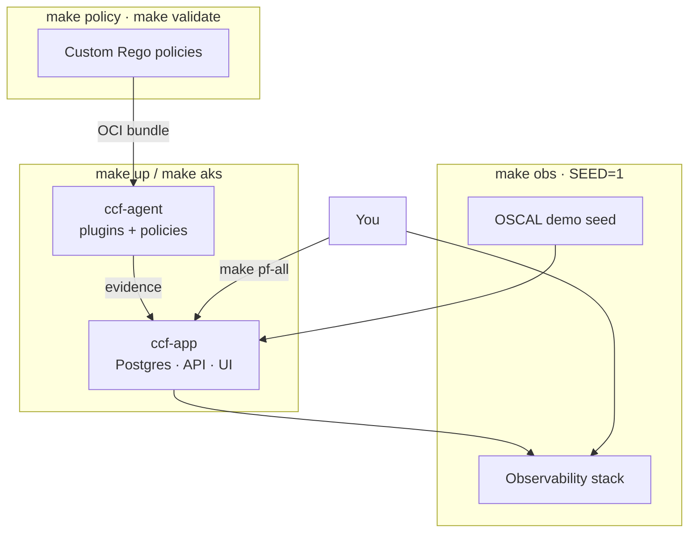

# CCF Helm charts — documentation

This repository packages the [Continuous Compliance Framework (CCF)](https://continuouscompliance.io/) for Kubernetes using Helm. These guides explain how CCF works, how to configure the charts, and how to extend the platform with plugins and custom policies.

## Overview



## Start here

| Guide | What you'll learn |
|-------|-------------------|
| [Quick start](./quickstart.md) | Local demo, AKS, GitHub plugin demo, observability, full workflows |
| [Architecture](./architecture.md) | Control plane, agent, plugins, policies, OSCAL, data flow |
| [Helm configuration](./helm-configuration.md) | Values layering, every chart knob, secrets, hooks, HA |
| [Plugins & policies](./policies-and-plugins.md) | Configure plugins, author Rego, build OCI bundles, wire them in |
| [Observability](./observability.md) | Loki, Prometheus, Grafana, Alloy, dashboards |
| [Makefile reference](./makefile-reference.md) | All `make` targets, variables, and examples |

## Repository layout

```
.
├── Chart.yaml                 Umbrella chart (ccf-app + ccf-agent [+ optional Bitnami Postgres])
├── values.yaml                Umbrella defaults
├── values/
│   ├── local.yaml             Docker Desktop overlay
│   ├── aks.yaml               AKS overlay
│   ├── postgres-ha.yaml       Bitnami HA Postgres + app-tier HA
│   └── plugins/               Reusable agent plugin overlays
├── charts/
│   ├── ccf-app/               PostgreSQL + API + UI (control plane)
│   │   ├── values.yaml
│   │   ├── values-production.yaml
│   │   └── seed/oscal/        Demo OSCAL documents (optional seed job)
│   └── ccf-agent/             Compliance agent (plugin scheduler)
│       ├── values.yaml
│       └── values-production.yaml
├── policies/                  Custom Rego policies (author, test, bundle, push)
├── observability/             Grafana, Alloy values for logs + metrics
├── argocd/                    GitOps Application manifests
└── Makefile                   Local/AKS automation
```

## Headline commands

```bash
make help        # list all public targets

make up          # CCF stack (local, Docker Desktop)
make obs         # observability stack (Loki/Prometheus/Grafana/Alloy)
make pf-all      # port-forward UI, API, Grafana, Prometheus, Loki

make aks         # CCF on AKS (current kube-context)
make policy      # validate + test custom Rego policies
make validate    # offline helm lint + render all overlays
```

## Image versions (known-good set)

| Component | Image | Tag (this repo) |
|-----------|-------|-----------------|
| API | `ghcr.io/compliance-framework/api` | `0.16.0` (via `ccf-app` Chart `appVersion`) |
| UI | `ghcr.io/compliance-framework/ui` | `2.9.1` |
| Agent | `ghcr.io/compliance-framework/agent` | `0.7.1` |
| PostgreSQL | `ghcr.io/compliance-framework/pg-ccf` | `0.0.5` |

The agent requires **API ≥ 0.13.0** (subject/risk template endpoints). Do not pair agent `0.7.x` with API `0.11.x`.

## External resources

- [CCF documentation](https://compliance-framework.github.io/docs/)
- [Plugin catalogue](https://github.com/orgs/compliance-framework/repositories?q=plugin-)
- [Upstream helm-charts](https://github.com/compliance-framework/helm-charts)
