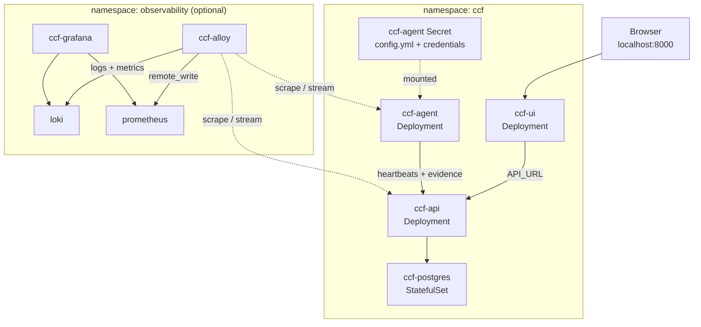
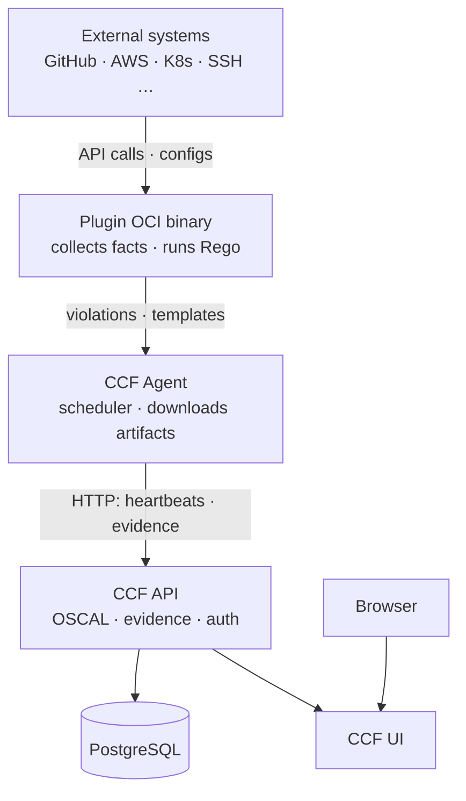
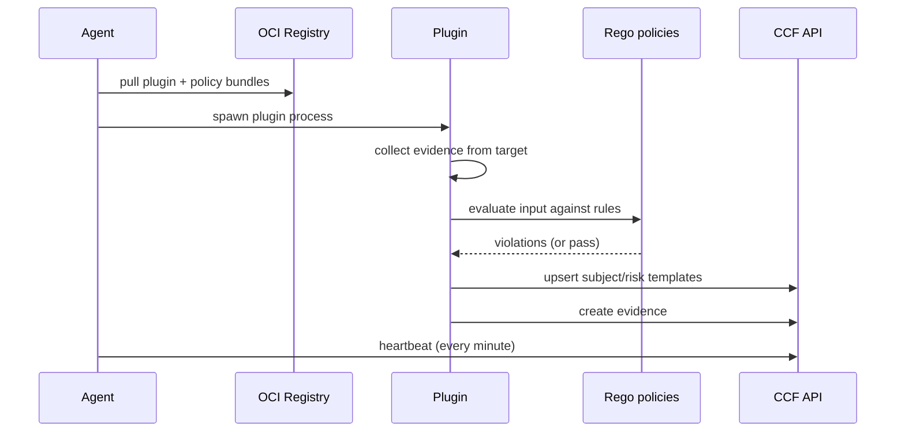
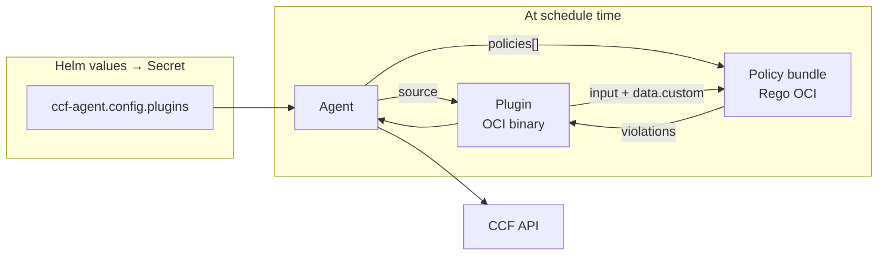

# CCF architecture

## What is CCF?

The **Continuous Compliance Framework (CCF)** continuously collects compliance evidence from your environment, evaluates it against **policies** (Rego/OPA rules), and stores structured results in a central **API** using **OSCAL** (Open Security Controls Assessment Language). A **UI** lets you inspect controls, findings, agents, and reports.

This Helm repo deploys two lifecycles:

| Chart | Role | Deploy |
|-------|------|--------|
| **`ccf-app`** | Control plane: PostgreSQL + API + UI | Once per organisation / cluster |
| **`ccf-agent`** | Plugin scheduler: pulls plugins, runs checks, reports to API | One or many (per cluster, namespace, edge) |

The **umbrella chart** (`ccf/`) composes both for a single-command install via `make up`, `make aks`, or `make prod`.

### Kubernetes deployment (this repo)



## Data flow



### Plugin run cycle (on cron schedule)



## Plugins vs policies vs agent

These three pieces are often confused:



| Piece | What it is | Where it runs | Configured in Helm |
|-------|------------|---------------|-------------------|
| **Agent** | Scheduler/orchestrator | `ccf-agent` Deployment | `ccf-agent.config`, `apiUrl`, image |
| **Plugin** | Collector + evaluator runner (OCI binary) | Spawned by agent per schedule | `ccf-agent.config.plugins.<name>.source` |
| **Policy bundle** | Rego rules (OCI tarball) | Loaded by plugin at runtime | `ccf-agent.config.plugins.<name>.policies[]` |

**You never deploy policies or plugins as separate Kubernetes workloads.** The agent config references OCI URLs; the agent downloads and executes them.

### Minimal plugin config (YAML → Secret → `/etc/ccf/config.yml`)

```yaml
ccf-agent:
  config:
    plugins:
      github_repos:
        schedule: "*/30 * * * *"
        source: ghcr.io/compliance-framework/plugin-github-repositories:v0.8.1
        policies:
          - ghcr.io/compliance-framework/plugin-github-repositories-policies:v0.7.0
        labels:
          provider: github
        config:
          organization: my-org
          token: ""   # inject at install time via --set-string (see Makefile)
```

The chart renders this into a **Secret** (not a ConfigMap) because tokens and credentials may appear under `config:`.

### Agent requirements

- At least **one plugin** must be configured, or the agent panics at startup.
- The agent sends **heartbeats** to `/agent/heartbeat`; the UI uses these to show registered agents.
- Plugin runs produce **evidence** visible under `/evidence/search` in the API.

## OSCAL and the empty UI

CCF starts with **no OSCAL content** by design. On **local**, `values/local.yaml` enables
`api.seedData.enabled` so a post-install Job imports demo catalogs, SSP, assessment plan,
results and POA&M automatically. Without that (or manual import), the UI looks bare:

1. **Seed demo data** — enabled by default on local; on AKS use `SEED=1`.
2. **Import your own** — `kubectl exec deploy/ccf-api -- /api oscal import -f document.json`
3. **Let plugins populate evidence** — agent findings map to controls when policies and catalog structure align.

Optional integrations (SSO/OIDC, email, Slack) are **off** unless you mount `sso.yaml`, `email.yaml`, or `slack.yaml` into the API pod — warnings in logs are expected without them.

## Observability (this repo)

All CCF pods carry `app.kubernetes.io/part-of=ccf`. The optional observability stack (`make obs`) adds:

- **Alloy** — pod logs → Loki; API metrics (Prometheus scrape) → Prometheus
- **Grafana** — pre-provisioned dashboard "CCF - Logs & Metrics"

The agent does **not** expose an application `/metrics` endpoint; its observability is primarily **logs** plus **pod-level** CPU/memory from cAdvisor.

## Version compatibility

| Agent | Minimum API | Notes |
|-------|-------------|-------|
| `0.7.x` | `0.13.0+` | Subject/risk template upserts |
| This repo | API `0.16.0`, UI `2.9.1`, Agent `0.7.1` | Tested together |

Pair plugin and policy bundle versions from the same plugin release notes when possible.

## See also

- [Components explained](./components.md) — detailed guide to each CCF piece (API, agent, plugin, policy, OSCAL)
- [Production deployment](./production.md) — standard prod profile, secrets, alerts, runbook
- [Helm configuration](./helm-configuration.md) — every values key
