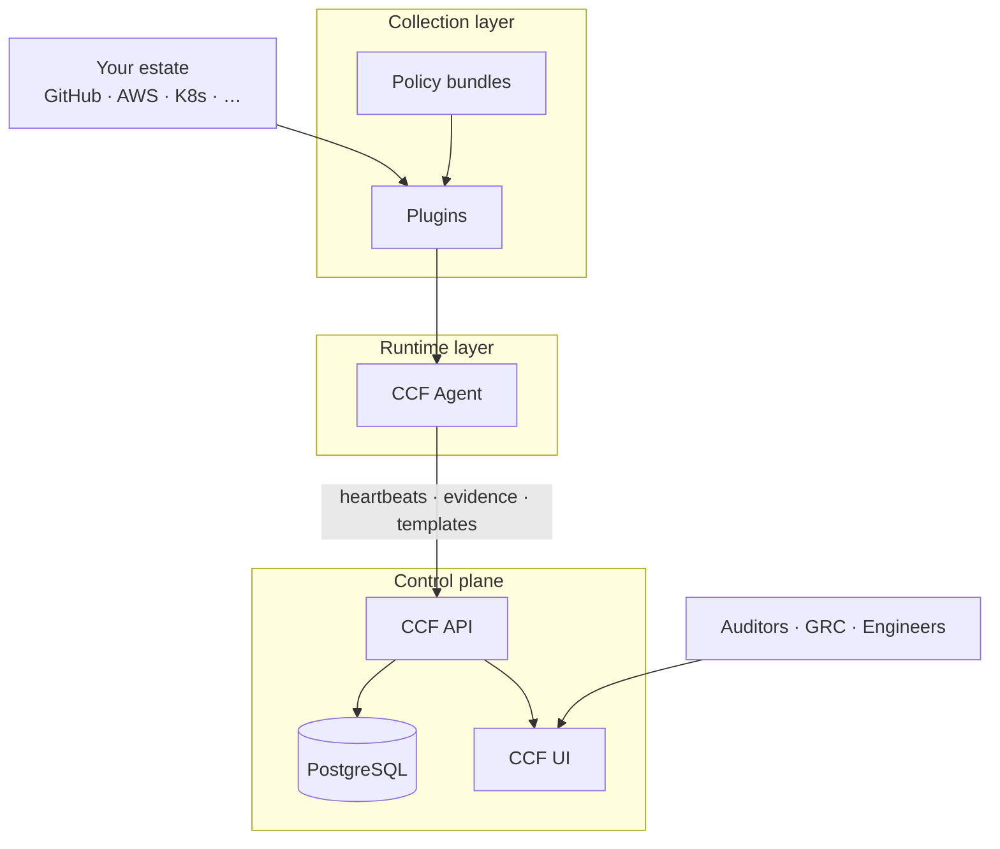

# CCF components explained

This guide explains **what each piece of the Continuous Compliance Framework (CCF) is**, what it does in compliance terms, and how this Helm chart maps it to Kubernetes. Read this before tuning values or writing policies.

## The big picture

CCF continuously answers one question: **“Are we compliant right now, and can we prove it?”**

It does that by:

1. **Collecting evidence** from your systems (GitHub, cloud, Kubernetes, SSH, …) via **plugins**
2. **Evaluating** that evidence against **policies** (Rego rules)
3. **Storing** structured results in a central **API** using the **OSCAL** standard
4. **Presenting** dashboards, controls, findings, and reports in the **UI**

---

## PostgreSQL (datastore)

| | |
|---|---|
| **What it is in CCF** | The **source of truth** for all compliance data: users, OSCAL documents, evidence, agent heartbeats, workflows, filters. |
| **Helm chart** | `ccf-app` → StatefulSet `ccf-postgres` (default) or external DB / Bitnami HA overlay |
| **Image** | `ghcr.io/compliance-framework/pg-ccf` |
| **When to use bundled** | Dev/demo/small installs |
| **Production** | Enable persistence + backups; prefer `values/production-ha.yaml` (Bitnami replication) or a managed PostgreSQL service |

The API runs **database migrations** automatically (`api.migrations.enabled`) so schema tables exist before login works.

**Values:** `ccf-app.postgres.*`, or disable with `postgres.enabled: false` and set `api.database.host` / `existingSecret`.

---

## CCF API (central reporting service)

| | |
|---|---|
| **What it is in CCF** | The **brain** of the platform. Accepts evidence from agents, stores OSCAL catalogs/SSPs/assessment plans/results, authenticates users (JWT), exposes REST endpoints and Swagger. |
| **Helm chart** | `ccf-app` → Deployment `ccf-api` |
| **Image** | `ghcr.io/compliance-framework/api` (this repo pins **0.16.0**) |
| **Port** | `8080` (HTTP API), `9090` (Prometheus metrics when enabled) |

### Responsibilities

- **Auth** — `/api/auth/login`, JWT, user management (`/api users add` CLI)
- **OSCAL** — import/export compliance documents (`/api oscal import`)
- **Evidence** — search and correlate plugin findings (`/api/evidence/search`)
- **Agents** — receive heartbeats (`/agent/heartbeat`) and batch template upserts
- **Admin** — subject templates, filters, workflows (UI configuration surfaces)

### Production characteristics (this chart)

| Feature | Values key |
|---------|------------|
| 2+ replicas | `api.replicaCount`, `api.autoscaling` |
| PDB | `api.pdb.enabled` |
| Pod anti-affinity | `api.affinity` |
| Metrics scrape | `api.metrics.enabled` → `:9090/metrics` |
| TLS DB | `api.database.sslmode: require` |
| Network isolation | `networkPolicy.enabled` |

**Swagger (after port-forward):** http://localhost:8080/swagger/index.html

---

## CCF UI (web frontend)

| | |
|---|---|
| **What it is in CCF** | The **operator console** — browse catalogs and controls, view assessment results, monitor agents, manage workflows, export reports. |
| **Helm chart** | `ccf-app` → Deployment `ccf-ui` |
| **Image** | `ghcr.io/compliance-framework/ui` (**2.9.1** in this repo) |
| **Config** | `config.json` with `API_URL` — must match how **your browser** reaches the API |

### Common confusion

| Symptom | Cause |
|---------|--------|
| UI loads but login/API calls fail | `ui.apiUrl` wrong for your access path (use `http://localhost:8080` with port-forward) |
| Empty catalogs/plans | No OSCAL imported yet (local: `seedData.enabled` in `values/local.yaml`) |
| No “configured” agents | Agent heartbeats OK but plugin failed or UI section needs OSCAL context — check agent logs |

---

## CCF Agent (plugin scheduler)

| | |
|---|---|
| **What it is in CCF** | A **long-running scheduler** that downloads plugins and policy bundles, runs them on a cron schedule, and reports results to the API. It is **not** the plugin itself — it orchestrates plugins. |
| **Helm chart** | `ccf-agent` → Deployment `ccf-agent` |
| **Image** | `ghcr.io/compliance-framework/agent` (**0.7.1**) |
| **Binary** | `./concom agent -c /etc/ccf/config.yml` |
| **Config** | Rendered to a **Secret** → mounted at `/etc/ccf/config.yml` |

### What the agent does every minute

1. Sends a **heartbeat** to the API (UI uses this to show live agents)
2. On each plugin’s **cron schedule**, downloads OCI artifacts and runs the plugin
3. Plugin returns **violations**, **evidence**, **subject/risk templates** → agent forwards to API

### Requirements

- **At least one plugin** in `config.plugins` — otherwise the agent **panics** at startup
- **API reachable** at `apiUrl` (default `http://ccf-api:8080` in-cluster)
- **API version ≥ 0.13** for template upserts (this repo uses 0.16.0)

### Production note

Run **one agent Deployment per estate** (cluster/org). Scale horizontally by deploying **separate agent releases** with different plugin sets (e.g. one agent for GitHub, another for AWS), not by increasing `replicaCount` on the same config (that would duplicate scans).

**Values:** `ccf-agent.config.plugins`, `ccf-agent.apiUrl`, `ccf-agent.pdb`

---

## Plugins (evidence collectors)

| | |
|---|---|
| **What they are in CCF** | **Specialised collectors** — each plugin knows how to talk to one class of system (GitHub repos, AWS accounts, Kubernetes clusters, SSH hosts, …), gather facts, and run policies against them. |
| **Format** | OCI binaries (`ghcr.io/compliance-framework/plugin-*`) |
| **Configured in** | `ccf-agent.config.plugins.<name>.source` |
| **Not a K8s workload** | Downloaded and executed by the agent on schedule |

Example plugins in this repo’s overlays:

| Overlay | Plugin | Good for |
|---------|--------|----------|
| `values/plugins/github.yaml` | `plugin-github-repositories` | Org/repo compliance demos |
| `values/plugins/local-ssh.yaml` | `plugin-local-ssh` | SSH hardening on **hosts with sshd** (not inside containers) |

Browse all: https://github.com/orgs/compliance-framework/repositories?q=plugin-

---

## Policies (compliance rules)

| | |
|---|---|
| **What they are in CCF** | **Machine-readable rules** (Rego/OPA) that decide if evidence is compliant. A policy defines `violation[...]` entries; no violations = pass. |
| **Format** | OCI bundles (`ghcr.io/.../plugin-*-policies` or your custom bundle) |
| **Configured in** | `ccf-agent.config.plugins.<name>.policies[]` |
| **Authoring** | [`policies/`](../policies/) + `make policy` / `make policy-push` |

Policies receive plugin evidence as **`input`** and optional static config as **`data.custom.*`** (from `policy_data` in Helm values).

See [Plugins & policies](./policies-and-plugins.md) for the full pipeline.

---

## OSCAL (data model)

| | |
|---|---|
| **What it is** | **Open Security Controls Assessment Language** — NIST’s standard JSON/XML format for catalogs, profiles, system security plans (SSPs), assessment plans, assessment results, and POA&Ms. |
| **Role in CCF** | How compliance state is **structured**, **stored**, and **exported** to auditors. |
| **Empty by default** | CCF does not ship your org’s compliance baseline — you import or seed it. |

This repo’s local overlay imports a demo “goodread” set (`charts/ccf-app/seed/oscal/`) so the UI is not blank on first login.

Production: import your real catalogs/SSPs via `/api oscal import` or your GRC tooling.

---

## How Helm maps to CCF

| CCF concept | Kubernetes resource | Chart |
|-------------|---------------------|-------|
| Control plane | Postgres + API + UI pods | `ccf-app` |
| Agent scheduler | Agent Deployment + Secret | `ccf-agent` |
| Plugin/policy config | Keys in agent Secret | `values/plugins/*.yaml` |
| Demo OSCAL | ConfigMap + hook Job | `seed/oscal/` + `api.seedData` |
| Admin user | Secret + hook Job | `api.adminUser` |
| Full stack | Single Helm release | Umbrella `ccf/` |

---

## Version matrix (this repository)

| Component | Version | Notes |
|-----------|---------|-------|
| API | 0.16.0 | Required for agent 0.7.x template APIs |
| UI | 2.9.1 | Paired with API 0.16.x |
| Agent | 0.7.1 | Requires API ≥ 0.13.0 |
| PostgreSQL image | 0.0.5 | Bundled StatefulSet |

Do not downgrade the API below 0.13 when using current agents.

---

## Next steps

- [Architecture & data flow](./architecture.md)
- [Helm configuration](./helm-configuration.md)
- [Production deployment](./production.md)
- [Plugins & policies](./policies-and-plugins.md)
