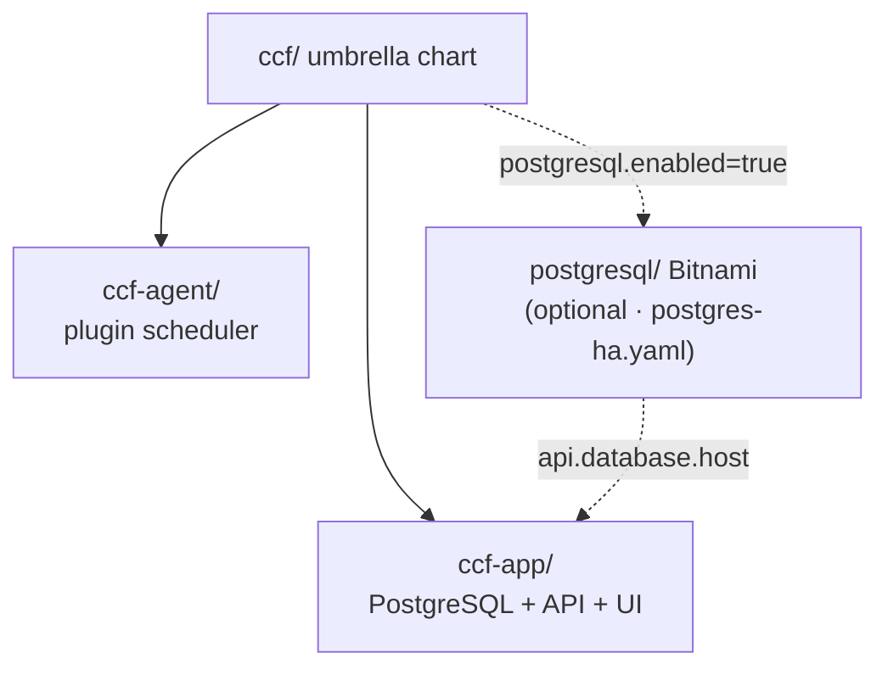
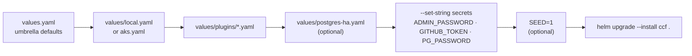
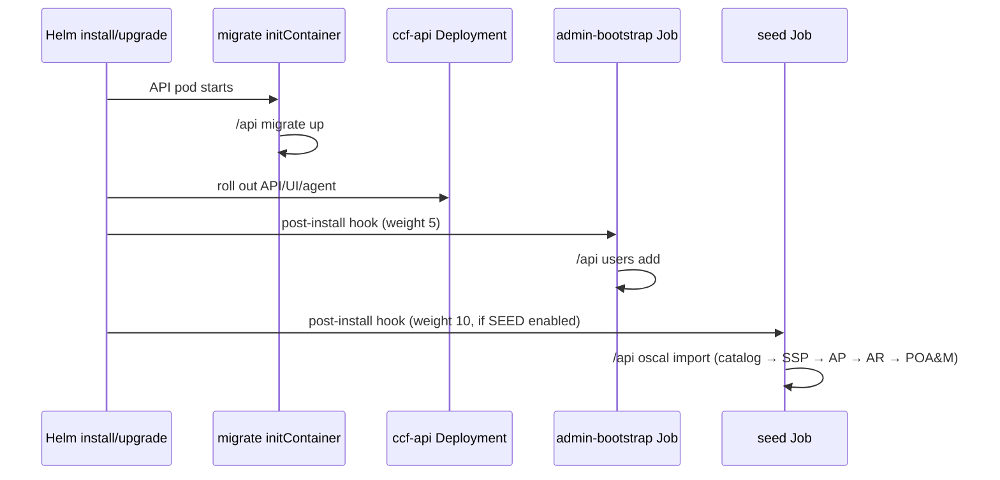

# Helm configuration guide

This guide covers how to install, layer values, and configure every major option in the CCF Helm charts.

## Chart hierarchy



### Values namespacing

| Install target | Values prefix | Example |
|----------------|---------------|---------|
| Umbrella `ccf` | `ccf-app.*`, `ccf-agent.*`, `postgresql.*` | `ccf-app.api.replicaCount: 2` |
| Subchart `ccf-app` | top-level keys | `api.replicaCount: 2` |
| Subchart `ccf-agent` | top-level keys | `config.plugins.github_repos...` |

Helm **deep-merges** multiple `-f` files. Later files override earlier keys.

### Values layering (merge order)



## Values layering strategy

Recommended order (first → last):

1. **Environment** — `values/local.yaml` or `values/aks.yaml`
2. **Plugin overlays** — one or more files from `values/plugins/`
3. **Optional overlays** — `values/postgres-ha.yaml`, custom files
4. **Secrets at install time** — `--set-string` / Makefile variables (never commit)

### Example: local with GitHub plugin

```bash
helm dependency build .

helm upgrade --install ccf . \
  --kube-context docker-desktop \
  --namespace ccf --create-namespace \
  -f values/local.yaml \
  -f values/plugins/github.yaml \
  --set-string ccf-agent.config.plugins.github_repos.config.token="$GITHUB_TOKEN" \
  --set-string ccf-agent.config.plugins.github_repos.config.organization=my-org
```

Or via Makefile:

```bash
make up PLUGIN_VALUES="values/plugins/github.yaml" \
  GITHUB_TOKEN=$GITHUB_TOKEN GITHUB_ORG=my-org
```

## Environment overlays

### `values/local.yaml` (Docker Desktop)

| Setting | Purpose |
|---------|---------|
| `postgres.persistence.enabled: false` | No PVC on laptop |
| `api.environment: local` | Relaxed HTTPS behaviour |
| `api.allowedOrigins` | CORS for `localhost:8000` / `:8080` |
| `ui.apiUrl: http://localhost:8080` | Browser reaches API via port-forward |
| `api.adminUser.enabled: true` | Default admin bootstrap |
| `networkPolicy.enabled: false` | Simpler local networking |

### `values/aks.yaml` (Azure Kubernetes Service)

| Setting | Purpose |
|---------|---------|
| `postgres.persistence.storageClass: managed-csi` | Azure Disk |
| `postgres.podSecurityContext.fsGroup: 999` | Postgres volume permissions on Azure |
| Resource requests/limits | Production-sized defaults |
| Comments at bottom | LoadBalancer / ingress examples |

### `values/postgres-ha.yaml` (reliability)

Enables:

- Bitnami PostgreSQL (`postgresql.enabled: true`) with replication architecture
- Disables built-in `ccf-app.postgres`
- Points API at `ccf-postgresql-primary`
- API/UI: 2 replicas, PDBs, pod anti-affinity

Requires password at install:

```bash
make up EXTRA_VALUES="values/postgres-ha.yaml" PG_PASSWORD='<strong-pw>'
```

## `ccf-app` — control plane

### PostgreSQL (`postgres.*`)

| Key | Default | Description |
|-----|---------|-------------|
| `postgres.enabled` | `true` | Deploy bundled StatefulSet |
| `postgres.auth.password` | `postgres` | DB password (change for non-local) |
| `postgres.auth.existingSecret` | `""` | Secret with `POSTGRES_USER`, `POSTGRES_PASSWORD`, `POSTGRES_DB` |
| `postgres.persistence.enabled` | `true` | PVC for data |
| `postgres.persistence.storageClass` | `""` | Cluster default if empty |
| `postgres.persistence.size` | `8Gi` | Volume size |

When using an external database:

```yaml
ccf-app:
  postgres:
    enabled: false
  api:
    database:
      host: my-postgres.example.com
      # or full connection string:
      connection: "host=... user=ccf password=... dbname=ccf sslmode=require"
```

### API (`api.*`)

| Key | Default | Description |
|-----|---------|-------------|
| `api.image.tag` | Chart `appVersion` (`0.16.0`) | API image tag |
| `api.environment` | `production` | Set `local` for dev |
| `api.allowedOrigins` | auto / empty | CORS origins (comma-separated) |
| `api.migrations.enabled` | `true` | Init container runs `/api migrate up` |
| `api.metrics.enabled` | `true` | Prometheus `/metrics` on port 9090 |
| `api.database.existingSecret` | `""` | Secret key `CCF_DB_CONNECTION` |
| `api.jwtSecret` | generated | JWT signing (or existing Secret) |

#### Admin bootstrap (`api.adminUser.*`)

Post-install Job creates the first UI user (idempotent):

```yaml
ccf-app:
  api:
    adminUser:
      enabled: true
      email: admin@ccf.local
      firstName: Admin
      lastName: User
      password: ""              # --set-string at install
      existingSecret: ""        # or Secret with key `password`
```

Makefile: `ADMIN_PASSWORD='...'` enables and injects the password.

#### Demo OSCAL seed (`api.seedData.enabled`)

Imports bundled JSON from `charts/ccf-app/seed/oscal/` in order:

1. `basic-catalog.json`
2. `goodread_ssp.json`
3. `goodread_ap.json`
4. `goodread_ar.json`
5. `goodread_poam.json`

Makefile: `SEED=1` or `--set ccf-app.api.seedData.enabled=true`

### UI (`ui.*`)

| Key | Default | Description |
|-----|---------|-------------|
| `ui.image.tag` | `2.9.1` | UI image (must match API generation) |
| `ui.apiUrl` | derived from ingress or empty | Written to `config.json` as `API_URL` |

For port-forward access, set `ui.apiUrl` to `http://localhost:8080` (as in `values/local.yaml`).

### Ingress (`ingress.*`)

```yaml
ccf-app:
  ingress:
    enabled: true
    className: nginx
    uiHost: ccf.example.com
    apiHost: api.ccf.example.com
    tls:
      - hosts: [ccf.example.com, api.ccf.example.com]
        secretName: ccf-tls
```

When hosts are set, CORS and UI `API_URL` are derived automatically.

### Network policies (`networkPolicy.*`)

Set `networkPolicy.enabled: true` in production to restrict:

- Only API → PostgreSQL
- Ingress/UI/Alloy → API
- Monitoring namespace → API metrics port

### Helm tests (`tests.*`)

`tests.enabled: true` installs a `helm test` hook Pod that curls API and UI in-cluster.

## `ccf-agent` — agent & plugins

| Key | Default | Description |
|-----|---------|-------------|
| `apiUrl` | `http://ccf-api:8080` | API endpoint (override if API elsewhere) |
| `config.daemon` | `true` | Run as long-lived scheduler |
| `config.verbosity` | `2` | Log level |
| `config.plugins` | `{}` | **Required**: at least one plugin |
| `extraEnv` / `extraEnvFrom` | `[]` | Optional env for API auth (`CCF_API_AUTH_*`) |

Plugin structure (rendered to Secret → `/etc/ccf/config.yml`):

```yaml
ccf-agent:
  config:
    plugins:
      <plugin_key>:
        schedule: "0 * * * *"          # cron
        source: ghcr.io/.../plugin:tag # OCI plugin binary
        policies:                       # OCI Rego bundles (one or more)
          - ghcr.io/.../policies:tag
        labels:                         # metadata on evidence
          team: platform
        config:                          # plugin-specific (may include secrets)
          organization: my-org
          token: ""
        policy_data:                     # optional Rego `data.custom.*`
          allow_public_repositories: false
```

**Disable agent only:**

```yaml
ccf-agent:
  enabled: false
```

## Helm hooks (Jobs)



| Hook | Weight | Trigger | Purpose |
|------|--------|---------|---------|
| `ccf-api-admin-bootstrap` | 5 | post-install/upgrade | Create default admin user |
| `ccf-api-seed` | 10 | post-install/upgrade | Import OSCAL demo data |
| `ccf-test-connection` | test | `helm test` | Connectivity check |

Hooks delete successful Jobs (`hook-succeeded`) so they do not clutter the namespace.

## Secrets injection (never in git)

| Secret | Makefile variable | Helm `--set-string` |
|--------|-------------------|---------------------|
| GitHub token | `GITHUB_TOKEN` | `ccf-agent.config.plugins.github_repos.config.token` |
| GitHub org | `GITHUB_ORG` | `ccf-agent.config.plugins.github_repos.config.organization` |
| HA Postgres password | `PG_PASSWORD` | `postgresql.auth.password` + `ccf-app.postgres.auth.password` |
| Admin password | `ADMIN_PASSWORD` | `ccf-app.api.adminUser.password` |

Add local secret-bearing files to `.gitignore` if you create custom value files.

## Production install (subcharts)

Use `values-production.yaml` per subchart — no plaintext passwords, HA, network policies, HPA:

```bash
# Create Secrets first (see charts/ccf-app/values-production.yaml comments)

helm upgrade --install ccf-app charts/ccf-app -n ccf --create-namespace \
  -f charts/ccf-app/values-production.yaml

helm upgrade --install ccf-agent charts/ccf-agent -n ccf \
  -f charts/ccf-agent/values-production.yaml \
  -f values/plugins/github.yaml \
  --set-string config.plugins.github_repos.config.token="$GITHUB_TOKEN"
```

Note: subchart install uses **top-level** keys (`config.plugins`, not `ccf-agent.config.plugins`).

## GitOps (Argo CD)

Manifests in [`argocd/`](../argocd/):

```bash
kubectl apply -n argocd -f argocd/root-application.yaml
```

Update `repoURL` and `targetRevision` to your fork. Prefer separate Applications for `ccf-app` and `ccf-agent` lifecycles.

## Validation before deploy

```bash
make validate     # lint + render all env × plugin combinations
helm template ccf . -f values/local.yaml -f values/plugins/github.yaml \
  --set-string ccf-agent.config.plugins.github_repos.config.token=dummy \
  | less
```

## Troubleshooting

| Symptom | Likely cause | Fix |
|---------|--------------|-----|
| Login fails / no users table | Migrations disabled | `api.migrations.enabled: true` or run `/api migrate up` |
| Agent CrashLoop / panic | No plugins | Add plugin overlay or `ccf-agent.enabled: false` |
| Plugin 404 on subject templates | API too old | Upgrade API to ≥ 0.13 (this repo: 0.16.0) |
| UI empty catalogs/plans | No OSCAL import | `SEED=1` or manual `oscal import` |
| UI can't reach API | Wrong `ui.apiUrl` | Match port-forward URL (`http://localhost:8080`) |
| GitHub plugin auth errors | Missing token | Pass `GITHUB_TOKEN` at install |

API Swagger (after port-forward): http://localhost:8080/swagger/index.html
