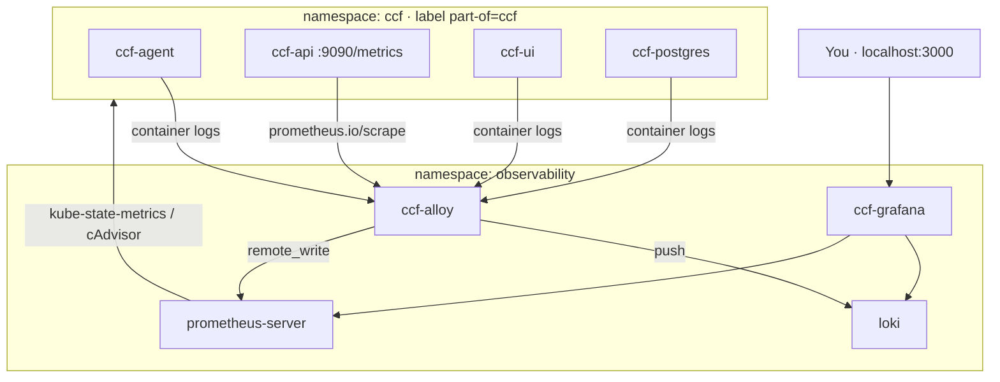

# Observability

This repo ships a self-contained observability stack for local demos and can be adapted for production backends.

## Components

| Component | Helm release | Purpose |
|-----------|--------------|---------|
| **Loki** | `loki` | Log aggregation |
| **Prometheus** | `prometheus` | Metrics storage (+ remote_write receiver) |
| **Grafana** | `ccf-grafana` | Dashboards (pre-provisioned) |
| **Grafana Alloy** | `ccf-alloy` | Collects CCF pod logs + API metrics |

Installed by:

```bash
make obs       # requires CCF running for Alloy to have targets
make pf-all    # expose all UIs locally
```

Config files:

- [`observability/alloy-values.yaml`](../observability/alloy-values.yaml) — log + metric collection
- [`observability/grafana-values.yaml`](../observability/grafana-values.yaml) — datasources + CCF dashboard

## What gets collected

### Logs (all CCF pods)

Alloy discovers pods with label `app.kubernetes.io/part-of=ccf` and streams container logs to Loki with labels:

- `namespace`, `pod`, `container`, `component`, `job=ccf`

Filter in Grafana/Loki:

```logql
{job="ccf", component="agent"}
```

### Metrics

| Source | How | Notes |
|--------|-----|-------|
| **API** | Prometheus scrape via `prometheus.io/scrape` annotations | `/metrics` on port 9090 |
| **Agent, UI, Postgres** | Pod-level via cAdvisor + kube-state-metrics | CPU, memory, restarts — no app `/metrics` |
| **Alloy remote_write** | Scrapes annotated pods → Prometheus | Job label `ccf` |

The agent **does not expose** application Prometheus metrics (by design in upstream CCF).

## Grafana dashboard

Pre-provisioned: **"CCF - Logs & Metrics"**

Sections:

1. Log volume by component + live log stream
2. API application metrics (goroutines, memory, scrape up)
3. Pod resources for all CCF components (CPU, memory, restarts)

Access:

```bash
make pf-all
# → http://localhost:3000  (admin / admin)
```

## Architecture



## Custom backends

To point at Grafana Cloud or managed Loki/Prometheus, edit endpoints in:

**Alloy** (`alloy-values.yaml`):

```hcl
loki.write "default" {
  endpoint { url = "https://..." }
}
prometheus.remote_write "default" {
  endpoint { url = "https://..." }
}
```

**Grafana** (`grafana-values.yaml`):

```yaml
datasources:
  datasources.yaml:
    apiVersion: 1
    datasources:
      - name: Prometheus
        url: https://your-prometheus...
      - name: Loki
        url: https://your-loki...
```

## Production notes

- Enable `networkPolicy.enabled` on `ccf-app` and set `monitoringNamespaceSelector` to the Alloy namespace
- Replace Grafana `admin/admin` credentials
- Enable persistence for Loki/Prometheus in non-demo environments
- The bundled stack uses `loki.useTestSchema=true` (no long-term persistence) — override for production

## Troubleshooting

| Issue | Check |
|-------|-------|
| No logs in Grafana | Alloy running? `kubectl -n observability logs deploy/ccf-alloy` |
| No API metrics | `api.metrics.enabled: true`? Annotations on API pods? |
| Loki install fails | Chart requires `loki.useTestSchema=true` for quick local setup (already in Makefile) |
| Grafana empty | Wait for Alloy to ship first logs; widen time range |

See also [Quick start §5](./quickstart.md#5-observability-logs--metrics).
