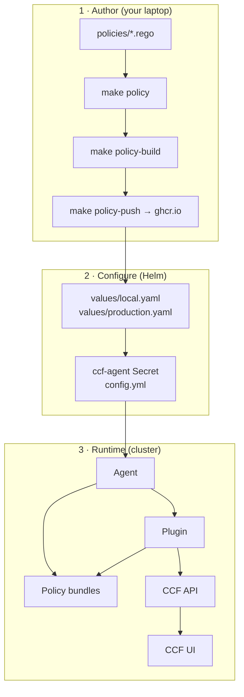
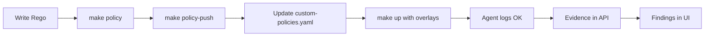

# Plugins and custom policies

This guide explains how CCF **plugins** collect evidence, how **policies** (Rego) evaluate that evidence, and how to wire both into the Helm chart.

## Mental model



**Policies are not a separate Kubernetes deployment.** They are OCI artifacts referenced in the agent config, pulled by the agent, and executed inside the plugin process.

## Step 1 — Choose a plugin

Official plugins live at https://github.com/orgs/compliance-framework/repositories?q=plugin-

Each plugin has a matching `*-policies` repository with upstream Rego bundles.

| Plugin | Configured in | Use case |
|--------|---------------|----------|
| `plugin-local-ssh` | `values/local.yaml` | Local demo |
| `plugin-github-repositories` | `values/production.yaml` | Org/repo compliance (prod) |
| Custom + upstream | Add to `ccf-agent.config.plugins.*.policies` | Your Rego bundle alongside stock policies |

### Enable a plugin (Helm)

Plugins are defined under `ccf-agent.config.plugins` in each environment overlay.

Production GitHub plugin (token injected at install):

```bash
make prod ADMIN_PASSWORD='...' GITHUB_TOKEN=$GITHUB_TOKEN GITHUB_ORG=my-org
```

Equivalent excerpt from `values/production.yaml`:

```yaml
ccf-agent:
  config:
    plugins:
      github_repos:
        schedule: "*/30 * * * *"
        source: ghcr.io/compliance-framework/plugin-github-repositories:v0.8.1
        policies:
          - ghcr.io/compliance-framework/plugin-github-repositories-policies:v0.7.0
        config:
          organization: ""
          token: ""
```

### Verify the agent

```bash
kubectl -n ccf logs deploy/ccf-agent -f
# Look for: plugin download, "Running plugin", heartbeats, evidence sent
```

## Step 2 — Understand policy structure (Rego)

Policies live in [`policies/`](../policies/). Each `.rego` file:

- Package name starts with `compliance_framework.`
- Exposes `violation[...]` rules (empty = pass)
- Optional: `title`, `description`, `remarks`, `risk_templates`

Example (GitHub repos) — [`policies/custom_repo_baseline.rego`](../policies/custom_repo_baseline.rego):

```rego
package compliance_framework.custom_repo_baseline

violation contains {"id": "missing_description"} if {
    not has_description
}

has_description if {
    input.settings.description
    input.settings.description != ""
}
```

The plugin passes collected repo settings as `input`. Inspect upstream `*-policies` repos for the exact `input` shape per plugin.

### `policy_data` (optional)

Pass static configuration into Rego as `data.custom.*`:

```yaml
ccf-agent:
  config:
    plugins:
      github_repos:
        policy_data:
          allow_public_repositories: false
```

Used in the example policy:

```rego
allow_public_repositories if {
    data.custom.allow_public_repositories == true
}
```

## Step 3 — Author and test policies locally

Prerequisites: [OPA](https://www.openpolicyagent.org/docs/latest/#running-opa) CLI.

```bash
make policy              # opa check + opa test (all policies/)
```

Or step by step:

```bash
make policy-validate     # compile / type-check
make policy-test         # run *_test.rego unit tests
```

Add tests alongside policies — see [`policies/custom_repo_baseline_test.rego`](../policies/custom_repo_baseline_test.rego).

## Step 4 — Build an OCI policy bundle

CCF distributes policies as **OCI artifacts** (same toolchain as upstream plugins).

```bash
make policy-build
# → dist/policies-bundle.tar.gz
```

Internally: `opa build -b policies/ -o dist/policies-bundle.tar.gz`

## Step 5 — Push to your registry

Requires [`gooci`](https://github.com/compliance-framework/gooci) and a registry token with **read/write packages**:

```bash
export GHCR_USER=myuser
export GHCR_TOKEN=ghp_xxx          # needs write:packages

make policy-push \
  POLICY_IMAGE=ghcr.io/my-org/ccf-custom-policies:v0.1.0 \
  GHCR_USER=$GHCR_USER \
  GHCR_TOKEN=$GHCR_TOKEN
```

Update `POLICY_IMAGE` in the Makefile or pass it on the command line.

## Step 6 — Reference the bundle in Helm

Add your OCI bundle to `ccf-agent.config.plugins.<name>.policies` in `values/production.yaml`:

```yaml
ccf-agent:
  config:
    plugins:
      github_repos:
        policies:
          - ghcr.io/compliance-framework/plugin-github-repositories-policies:v0.7.0
          - ghcr.io/my-org/ccf-custom-policies:v0.1.0   # your bundle
        policy_data:
          allow_public_repositories: false
```

Deploy:

```bash
make prod ADMIN_PASSWORD='...' GITHUB_TOKEN=$GITHUB_TOKEN GITHUB_ORG=my-org
```

The agent pulls **both** bundles; Rego from all listed policies is evaluated together.

## End-to-end checklist



- [ ] Plugin overlay configured (`source`, `schedule`, `config`)
- [ ] Upstream policy bundle referenced under `policies[]`
- [ ] Custom policies written, `make policy` passes
- [ ] Bundle built and pushed (`make policy-push`)
- [ ] Custom bundle URL added to `policies[]`
- [ ] Secrets injected at install (`GITHUB_TOKEN`, etc.)
- [ ] Agent logs show successful plugin run
- [ ] API `/evidence/search` returns findings
- [ ] UI shows agent heartbeats and compliance data

## GitHub App tokens (advanced)

The GitHub plugin accepts a **bearer token** in `config.token`. GitHub Apps do not configure directly in the plugin — generate a short-lived **installation access token** and pass it as `token`:

```bash
# Pseudocode: JWT from App private key → installation token
INSTALL_TOKEN=$(curl ... /app/installations/$ID/access_tokens | jq -r .token)

make prod ADMIN_PASSWORD='...' GITHUB_TOKEN=$INSTALL_TOKEN GITHUB_ORG=my-org
```

Installation tokens expire in ~1 hour. For recurring schedules, automate token refresh or use a fine-grained PAT for demos.

## Common mistakes

| Mistake | Result |
|---------|--------|
| Policies without matching plugin | Rego `input` shape mismatch — no meaningful violations |
| Only custom bundle, no upstream | May miss baseline checks the plugin expects |
| Token in values file committed to git | Credential leak — use `--set-string` / Makefile |
| Agent with zero plugins | Agent panic at startup |
| `local-ssh` in container | `sshd: not found` — use GitHub/K8s/cloud plugins instead |

## Further reading

- [`policies/README.md`](../policies/README.md) — policy authoring reference
- [Architecture](./architecture.md) — how components connect
- [Helm configuration](./helm-configuration.md) — all chart values
