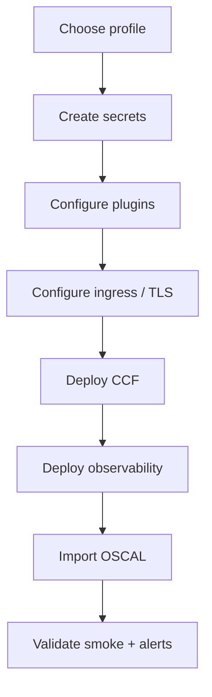

# Production deployment guide

This document describes how to deploy the **standard CCF Helm package** from this repository in a production-grade configuration: reliability, secrets, observability, alerts, and operational runbooks.

## Standard package overview

This repo is the **reference Helm distribution** for CCF on Kubernetes:

| Chart | Purpose |
|-------|---------|
| **`ccf/`** (umbrella) | One-command install: Postgres + API + UI + Agent |
| **`ccf-app/`** | Control plane only (API, UI, Postgres, seed/admin jobs) |
| **`ccf-agent/`** | Agent scheduler (plugins configured separately) |

**Production profile files:**

| File | Use when |
|------|----------|
| [`values/production.yaml`](../values/production.yaml) | Standard production (bundled Postgres with persistence) |
| [`values/production-ha.yaml`](../values/production-ha.yaml) | Production + Bitnami PostgreSQL HA |
| [`charts/ccf-agent/values-production.yaml`](../charts/ccf-agent/values-production.yaml) | Hardened agent defaults |

---

## Pre-flight checklist



- [ ] Kubernetes 1.24+ with default StorageClass (or set `postgres.persistence.storageClass`)
- [ ] Secrets created **before** install (see below) — production overlay uses `existingSecret`, not inline passwords
- [ ] At least **one plugin** configured on the agent (agent will not start without plugins)
- [ ] **OSCAL** import plan (production sets `seedData.enabled: false`)
- [ ] **Ingress / TLS** for UI and API (or private cluster + VPN)
- [ ] **Observability** stack (`make obs`) or equivalent Prometheus + Loki + Grafana
- [ ] **Backup** strategy for PostgreSQL

---

## Deploy on AKS (example)

```bash
# 1. Secrets (example — use your secret manager in real prod)
kubectl create namespace ccf
kubectl create secret generic ccf-postgres-credentials -n ccf \
  --from-literal=POSTGRES_USER=ccf \
  --from-literal=POSTGRES_PASSWORD="$(openssl rand -base64 24)" \
  --from-literal=POSTGRES_DB=ccf

# API connection string + JWT (keys expected by the API Deployment)
kubectl create secret generic ccf-db-connection -n ccf \
  --from-literal=CCF_DB_CONNECTION="host=ccf-postgres user=ccf password=REPLACE dbname=ccf port=5432 sslmode=require" \
  --from-literal=CCF_JWT_SECRET="$(openssl rand -base64 32)"

kubectl create secret generic ccf-admin-credentials -n ccf \
  --from-literal=email=admin@yourcompany.com \
  --from-literal=password="$(openssl rand -base64 16)"

# 2. Plugin token (example: GitHub)
export GITHUB_TOKEN="ghp_..."

# 3. Deploy
make aks \
  VALUES="-f values/aks.yaml -f values/production.yaml -f values/production-ha.yaml \
          -f values/plugins/github.yaml" \
  GITHUB_TOKEN="$GITHUB_TOKEN"

# 4. Observability (separate namespace)
make obs

# 5. Validate
make validate
make smoke
```

For non-AKS clusters, use `helm upgrade --install` directly with the same value files and your kube-context.

---

## Production values explained

### Reliability (`values/production.yaml`)

| Setting | Default in prod overlay | Why |
|---------|-------------------------|-----|
| `api.replicaCount: 2` | HA API | Survive node failure |
| `api.pdb.minAvailable: 1` | PDB | Safe during voluntary disruption |
| `api.autoscaling` | HPA 2–5 | Load-based scale |
| `ui.replicaCount: 2` | HA UI | Same |
| `agent.pdb` | minAvailable 1 | Agent must stay scheduled |
| `postgres.persistence.enabled` | true | Data survives pod restart |

### Security

| Setting | Production behavior |
|---------|---------------------|
| `api.adminUser.existingSecret` | No plaintext admin password in values |
| `api.database.existingSecret` | DB creds from Secret |
| `api.jwt.existingSecret` | JWT signing key from Secret |
| `networkPolicy.enabled` | Restrict east-west traffic to required ports |
| `podSecurityContext` / `securityContext` | non-root, drop caps, read-only root FS |

### What production disables

| Setting | Value | Reason |
|---------|-------|--------|
| `api.seedData.enabled` | `false` | Demo OSCAL must not land in prod |
| Inline passwords in values | omitted | Use Secrets |

---

## Secrets reference

| Secret name | Keys | Used by |
|-------------|------|---------|
| `ccf-postgres-credentials` | `POSTGRES_USER`, `POSTGRES_PASSWORD`, `POSTGRES_DB` | Bundled Postgres StatefulSet |
| `ccf-db-connection` | `CCF_DB_CONNECTION`, `CCF_JWT_SECRET` | API Deployment + hook Jobs |
| `ccf-admin-credentials` | `email`, `password` (or set via `--set-string`) | Bootstrap admin Job |
| Plugin-specific | e.g. `token` in agent Secret | Agent plugin config |

Create via External Secrets Operator, Azure Key Vault CSI, or Sealed Secrets in GitOps — the chart only expects Kubernetes Secrets at install time.

---

## Ingress and UI API URL

Production enables ingress stubs in `values/production.yaml`. You **must** set:

```yaml
ingress:
  api:
    hosts:
      - host: api.ccf.example.com
        paths: [...]
  ui:
    hosts:
      - host: ccf.example.com
        paths: [...]

ui:
  apiUrl: "https://api.ccf.example.com"   # browser-visible URL
```

The UI runs in the **user’s browser**; `ui.apiUrl` must be reachable from the client, not only from inside the cluster.

---

## Observability

### Metrics

| Source | Endpoint | Collector |
|--------|----------|-----------|
| CCF API | `:9090/metrics` | Grafana Alloy → Prometheus |
| Kubernetes | cAdvisor / kube-state-metrics | Prometheus (default chart) |
| Agent | **No HTTP metrics** | Logs via Loki; pod restarts via Prometheus |

Enable API metrics: `api.metrics.enabled: true` (on in production overlay).

### Logs

Alloy (`observability/alloy-values.yaml`) ships container logs from `ccf` and `observability` namespaces to Loki.

Useful LogQL:

```logql
{namespace="ccf", pod=~"ccf-agent.*"} |= "error"
{namespace="ccf", pod=~"ccf-api.*"} |= "heartbeat"
```

### Dashboard

Grafana ships with a pre-built **CCF Overview** dashboard (`observability/grafana-values.yaml`). After `make pf-all`, open http://localhost:3000 (admin/admin).

### Alerts

`observability/prometheus-values.yaml` defines Prometheus rules:

| Alert | Severity | Meaning |
|-------|----------|---------|
| `CCFAPINotReady` | critical | No API replicas |
| `CCFUINotReady` | critical | No UI replicas |
| `CCFAgentNotReady` | critical | No agent replicas |
| `CCFPostgresNotReady` | critical | DB not ready |
| `CCFContainerRestartBurst` | warning | Crash loop |
| `CCFAPIMetricsTargetDown` | warning | Scraping broken |
| `CCFAlloyNotReady` / `CCFLokiNotReady` | warning | Observability degraded |

View in Prometheus → **Alerts** tab (http://localhost:9091 after `make pf-all`).

**Alertmanager** is disabled in the default `make obs` install. For paging (PagerDuty, Slack), enable Alertmanager in the Prometheus chart and route `severity=critical` alerts.

---

## Operational runbook

### Health checks

```bash
make validate    # pods, services, API /health
make smoke       # login + evidence search API
kubectl logs -n ccf deploy/ccf-agent --tail=100
kubectl logs -n ccf deploy/ccf-api --tail=100
```

### Agent not visible / no findings

1. Confirm API version ≥ 0.13 (`kubectl get deploy ccf-api -o jsonpath='{.spec.template.spec.containers[0].image}'`)
2. Check agent logs for plugin download/run errors
3. Confirm plugin credentials (e.g. GitHub token) are valid
4. Remember: heartbeats ≠ successful plugin runs

### Database backup (bundled Postgres)

```bash
kubectl exec -n ccf ccf-postgres-0 -- pg_dump -U ccf ccf > ccf-backup-$(date +%F).sql
```

For HA Bitnami chart, follow Bitnami backup docs or use managed PostgreSQL with automated backups.

### Upgrade procedure

1. Review [CCF release notes](https://github.com/compliance-framework) for API/UI/agent compatibility
2. `helm template` with your value overlays (`make validate` includes production profiles)
3. Upgrade control plane first: `helm upgrade ccf ./charts/ccf -n ccf -f ...`
4. Upgrade agent if image tag changed
5. Run `make smoke`

### Rollback

```bash
helm rollback ccf -n ccf
# or agent:
helm rollback ccf-agent -n ccf
```

---

## GitOps recommendations

- Store **value overlays** in git; store **secrets** in External Secrets / Key Vault
- Pin **image tags** explicitly in values (production overlay does this)
- Separate releases: `ccf-app` in `ccf` namespace, agents per estate
- Do not commit `GITHUB_TOKEN` or DB passwords

Example ApplicationSet structure:

```
apps/ccf/base/values/production.yaml
apps/ccf/overlays/prod-eu/kustomization.yaml  # or helm values patch
apps/ccf/overlays/prod-eu/plugins-github.yaml
```

---

## Local vs production

| Concern | Local (`values/local.yaml`) | Production (`values/production.yaml`) |
|---------|----------------------------|----------------------------------------|
| Replicas | 1 | 2+ with HPA |
| Secrets | Inline demo passwords OK | `existingSecret` only |
| Seed OSCAL | `seedData.enabled: true` | `false` |
| NetworkPolicy | off | on |
| Ingress | off (port-forward) | on |
| Postgres | single pod | persistence + optional HA |

---

## Related docs

- [Components explained](./components.md) — what API, agent, plugin, policy, OSCAL mean
- [Helm configuration](./helm-configuration.md) — every values key
- [Observability](./observability.md) — stack details
- [Architecture](./architecture.md) — data flow diagrams
