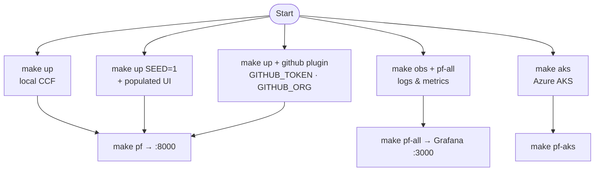

# Quick start workflows

Step-by-step recipes for common CCF deployments using this repo.

## Demo flows at a glance



## Prerequisites

- **Local:** Docker Desktop with Kubernetes enabled, `kubectl`, `helm`
- **AKS:** Azure CLI, `kubectl`, `helm`, an AKS cluster
- **Policies:** [OPA CLI](https://www.openpolicyagent.org/) for `make policy`

Run `make help` anytime for the command list.

---

## 1. Local CCF demo (minimum)

```bash
make up          # CCF on docker-desktop (admin + local-ssh plugin)
make pf          # UI :8000, API :8080
```

Open http://localhost:8000 — login:

- Email: `admin@ccf.local`
- Password: `Admin12345!`

Tear down: `make down`

---

## 2. Local demo with populated UI (OSCAL seed)

Local installs import demo OSCAL automatically (`api.seedData.enabled: true` in
`values/local.yaml`). After `make up`, hard-refresh the browser.

```bash
make up
make pf
```

Files imported: `charts/ccf-app/seed/oscal/` (catalog → SSP → plan → results → POA&M).

---

## 3. GitHub organisation demo

Scan your GitHub org repos for compliance findings.

```bash
export GITHUB_TOKEN=ghp_xxx    # read-only PAT
export GITHUB_ORG=my-org

make up SEED=1 \
  PLUGIN_VALUES="values/plugins/github.yaml" \
  GITHUB_TOKEN=$GITHUB_TOKEN GITHUB_ORG=$GITHUB_ORG

make pf
```

Watch the agent:

```bash
kubectl --context docker-desktop -n ccf logs deploy/ccf-agent -f
```

Verify evidence in the API (after port-forward on 8080):

```bash
curl -s -H "Authorization: Bearer $TOKEN" \
  -X POST http://localhost:8080/api/evidence/search -d '{}' | jq '.data | length'
```

---

## 4. Custom policies on GitHub plugin

```bash
# 1. Author & test
make policy

# 2. Push bundle (update image to your registry)
make policy-push \
  POLICY_IMAGE=ghcr.io/my-org/ccf-custom-policies:v0.1.0 \
  GHCR_USER=$GHCR_USER GHCR_TOKEN=$GHCR_TOKEN

# 3. Edit values/plugins/custom-policies.yaml with your POLICY_IMAGE

# 4. Deploy
make up SEED=1 \
  PLUGIN_VALUES="values/plugins/github.yaml values/plugins/custom-policies.yaml" \
  GITHUB_TOKEN=$GITHUB_TOKEN GITHUB_ORG=$GITHUB_ORG
```

See [Plugins & policies](./policies-and-plugins.md) for the full guide.

---

## 5. Observability (logs + metrics)

Requires CCF already running (`make up`).

```bash
make obs       # Loki + Prometheus + Grafana + Alloy
make pf-all    # forward UI, API, Grafana, Prometheus, Loki
```

| URL | Credentials |
|-----|-------------|
| http://localhost:8000 | CCF UI — `admin@ccf.local` / `Admin12345!` |
| http://localhost:3000 | Grafana — `admin` / `admin` |

Open Grafana → dashboard **"CCF - Logs & Metrics"**.

---

## 6. AKS deployment

```bash
az aks get-credentials --resource-group <rg> --name <aks>

make aks SEED=1 ADMIN_PASSWORD='<strong-password>' \
  PLUGIN_VALUES="values/plugins/github.yaml" \
  GITHUB_TOKEN=$GITHUB_TOKEN GITHUB_ORG=$GITHUB_ORG

make pf-aks    # UI/API on localhost
```

Optional HA Postgres:

```bash
make aks EXTRA_VALUES="values/postgres-ha.yaml" \
  PG_PASSWORD='<strong-pw>' ADMIN_PASSWORD='<strong-pw>'
```

---

## 7. Validate without a cluster

```bash
make validate    # helm lint + render all overlays
make policy      # opa check + test
```

---

## 8. Smoke test on live cluster

After `make up`:

```bash
make smoke       # wait for rollouts + helm test (API OK / UI OK)
```

---

## 9. Production (split lifecycles)

```bash
# Create DB + JWT secrets first (see charts/ccf-app/values-production.yaml)

helm upgrade --install ccf-app charts/ccf-app -n ccf --create-namespace \
  -f charts/ccf-app/values-production.yaml

helm upgrade --install ccf-agent charts/ccf-agent -n ccf \
  -f charts/ccf-agent/values-production.yaml \
  -f values/plugins/github.yaml \
  --set-string config.plugins.github_repos.config.token="$GITHUB_TOKEN" \
  --set-string config.plugins.github_repos.config.organization="$GITHUB_ORG"
```

GitOps: `kubectl apply -n argocd -f argocd/root-application.yaml`

---

## 10. Manual OSCAL import

Add your own compliance documents:

```bash
kubectl -n ccf cp my-catalog.json deploy/ccf-api:/tmp/catalog.json
kubectl -n ccf exec deploy/ccf-api -- /api oscal import -f /tmp/catalog.json
```

Or extend `charts/ccf-app/seed/oscal/` and enable `api.seedData.enabled`.

---

## Troubleshooting quick reference

| Problem | Action |
|---------|--------|
| `docker-desktop` not reachable | Start Docker Desktop → Enable Kubernetes |
| Can't login | Check migrations: `kubectl logs deploy/ccf-api -c migrate` |
| No agents in UI | Check agent logs + API version ≥ 0.13 |
| Empty UI sections | Run with `SEED=1` or import OSCAL |
| Plugin errors | `kubectl logs deploy/ccf-agent` — often missing token or wrong plugin for environment |

Full details: [Helm configuration — Troubleshooting](./helm-configuration.md#troubleshooting)
