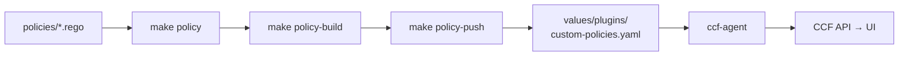

# Custom CCF policies

Author, test, bundle, and deploy **Rego (OPA) policies** that evaluate evidence collected by CCF plugins.

> **Full integration guide:** [docs/policies-and-plugins.md](../docs/policies-and-plugins.md)

## How policies connect to CCF



Policies are **not** deployed as Kubernetes resources. The pipeline is:

1. Write Rego under this directory
2. Test with `make policy`
3. Build + push OCI bundle with `make policy-push`
4. Reference the bundle in `plugins.<name>.policies[]` (Helm overlay)
5. Agent pulls and plugin evaluates at schedule time

## Directory layout

```
policies/
├── custom_repo_baseline.rego        example policy (GitHub repositories)
├── custom_repo_baseline_test.rego   unit tests
└── README.md
```

## Policy anatomy

Package name must start with `compliance_framework.`:

```rego
package compliance_framework.my_policy

# Required: violations (empty set = compliant)
violation contains {"id": "some_breach"} if {
    input.settings.some_field == "bad"
}

# Recommended metadata for reports
title := "My policy title"
description := "What this policy checks"
remarks := "Why it matters"

# Optional OSCAL-style risk/remediation templates
risk_templates := [
    {
        "name": "Example risk",
        "title": "Human-readable title",
        "statement": "Risk description",
        "remediation": {
            "title": "How to fix",
            "tasks": [{"title": "Step one"}],
        },
    },
]
```

### Input shape

The plugin passes collected evidence as `input`. Inspect the matching plugin's upstream `*-policies` repo for examples. The GitHub plugin uses shapes like:

```rego
input.settings.description
input.settings.visibility      # "public" | "private"
input.settings.archived        # true | false
```

### Policy data (`data.custom.*`)

Static config from Helm `policy_data`:

```yaml
# in values/production.yaml under ccf-agent.config.plugins.<name>
policy_data:
  allow_public_repositories: false
```

```rego
default allow_public := false
allow_public if { data.custom.allow_public_repositories == true }
```

## Commands

From the repo root:

```bash
make policy            # validate (opa check) + unit tests (opa test)
make policy-build      # build dist/policies-bundle.tar.gz
make policy-push \      # push to OCI registry
  POLICY_IMAGE=ghcr.io/<your-org>/ccf-custom-policies:v0.1.0 \
  GHCR_USER=<user> \
  GHCR_TOKEN=$GHCR_TOKEN
```

Requires:

- [OPA CLI](https://www.openpolicyagent.org/docs/latest/#running-opa)
- `gooci` (installed automatically by `make policy-push` via `go install`)

## Deploy with Helm

1. Push your bundle (above)
2. Set your OCI image in [`values/plugins/custom-policies.yaml`](../values/plugins/custom-policies.yaml)
3. Deploy:

```bash
make prod ADMIN_PASSWORD='...' GITHUB_TOKEN=$GITHUB_TOKEN GITHUB_ORG=<your-org> \
  PLUGIN_VALUES="values/plugins/github.yaml values/plugins/custom-policies.yaml"
```

Both upstream and custom bundles are listed under `policies[]` — the agent pulls all of them.

## Writing tests

Add `*_test.rego` files alongside policies:

```rego
package compliance_framework.my_policy_test

import data.compliance_framework.my_policy as policy

test_compliant if {
    inp := {"settings": {"some_field": "good"}}
    count(policy.violation) == 0 with input as inp
}
```

Run: `make policy` or `opa test policies/ -v`

## Example: repository baseline

[`custom_repo_baseline.rego`](./custom_repo_baseline.rego) checks GitHub repos for:

- Non-empty description
- Not archived without process
- Public visibility unless allow-listed via `policy_data`

See [`custom_repo_baseline_test.rego`](./custom_repo_baseline_test.rego) for test patterns.

## Further reading

- [Plugins & policies guide](../docs/policies-and-plugins.md)
- [Architecture — plugins vs policies](../docs/architecture.md#plugins-vs-policies-vs-agent)
- [Helm configuration — agent values](../docs/helm-configuration.md#ccf-agent--agent--plugins)
- [Upstream example](https://github.com/compliance-framework/plugin-github-repositories-custom-policies)
